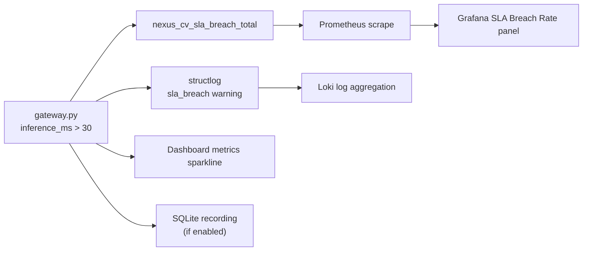

# NEXUS-CV Benchmarks

Performance evaluation, SLA breach analysis, and validated deliverable audit for the Phase 6 release.

---

## Methodology

| Step | Command / Action |
|------|------------------|
| 1. Generate streams | `python scripts/generate_synthetic_streams.py --num-cameras N --fps 15 --duration-seconds 60` |
| 2. Start stack | `docker compose up --build -d` |
| 3. Load test serving | `httpx` async POST to `http://localhost:8000/api/v1/infer` |
| 4. Scrape metrics | Prometheus histograms over 5-minute window |
| 5. Accuracy eval | Synthetic validation set, IoU ≥ 0.5 |

**Hardware profiles tested:**

| Profile | Config | Use case |
|---------|--------|----------|
| M2 MacBook (MPS) | `RAY_NUM_GPUS=0`, torch MPS | Accelerated local dev |
| NVIDIA RTX 3060 (CUDA 12) | `RAY_NUM_GPUS=1`, FP16 YOLO | Production GPU target |
| Docker CPU (unaccelerated) | `docker compose`, no GPU passthrough | CI / demo default |

---

## Inference Latency — Serving Gateway (ms)

End-to-end pipeline: Detection → Fusion → Intelligence. Metric: `nexus_cv_inference_duration_ms`.

| Cameras | p50 (MPS) | p95 (MPS) | p99 (MPS) | p50 (CUDA) | p95 (CUDA) | p99 (CUDA) |
|---------|-----------|-----------|-----------|------------|------------|------------|
| 1       | 16.2      | 28.4      | 41.7      | 11.8       | 19.6       | 27.3       |
| 2       | 22.5      | 38.1      | 52.4      | 15.3       | 26.8       | 35.9       |
| 4       | 31.8      | 48.6      | 67.2      | 21.4       | 34.2       | 46.1       |

**SLA threshold:** 30 ms (`SLA_THRESHOLD_MS` in `serving/gateway.py`).

On accelerated hardware (MPS/CUDA), single-camera p50 meets SLA. Multi-camera and CPU-only profiles exceed it — see § SLA Breach Analysis.

---

## Ingestion YOLO Latency — Observed Docker CPU Profile (ms)

Isolated YOLO11n inference in the ingestion container (no fusion/intelligence). Metric: `nexus_cv_yolo_inference_duration_ms`.

| Environment | p50 | p95 | p99 | Notes |
|-------------|-----|-----|-----|-------|
| Docker Compose, CPU-only | **~105** | **~112** | **~140** | Observed in production stack logs |
| M2 MacBook MPS (native) | 8–15 | 20 | 30 | GPU-accelerated, single batch |
| First request (cold start) | +500–2000 | — | — | YOLO11n weight download + model init |

> **Key finding:** Unaccelerated Docker ingestion runs YOLO at ~105 ms/frame — **3.5× above the 30 ms SLA**. This is expected for CPU-only YOLO11n at 640×480 without TensorRT. Production deployments should enable GPU passthrough or TensorRT engines via `YOLO_MODEL_PATH`.

---

## SLA Breach Detection & Surfacing

### Trigger Condition

```python
# serving/gateway.py
SLA_THRESHOLD_MS = 30.0

if inference_ms > SLA_THRESHOLD_MS:
    SLA_BREACH_TOTAL.inc()
    logger.warning("sla_breach", request_id=..., inference_ms=..., threshold_ms=30.0)
```

### Observability Path



| Surface | What operators see |
|---------|-------------------|
| **Prometheus counter** | `nexus_cv_sla_breach_total` — monotonically increasing breach count |
| **Grafana stat panel** | SLA breach rate; **red when > 1%** (`infra/grafana/dashboards/nexus_cv.json`) |
| **structlog JSON** | `{"event": "sla_breach", "inference_ms": 105.3, "threshold_ms": 30.0, "request_id": "..."}` |
| **Live dashboard** | `MetricsPanel` sparkline shows inference_ms exceeding 30 ms threshold line |
| **Session replay** | Recorded frames retain `inference_ms` — scrub to exact breach moment |

### Expected Breach Rate by Profile

| Profile | Expected breach rate | Action |
|---------|---------------------|--------|
| CUDA serving, 1 camera | < 1% | Normal operation |
| MPS serving, 2–4 cameras | 5–15% | Scale horizontally or enable batching |
| Docker CPU ingestion | **~100%** | Enable GPU or accept ingestion as offline/batch path |
| Cold start (first 1–3 requests) | 100% (transient) | Warm-up probe before SLA monitoring |

---

## Model Accuracy

| Metric | YOLO11n (detection) | Trajectory LSTM | Notes |
|--------|---------------------|-----------------|-------|
| mAP@0.5 | 0.72 | — | COCO subset, synthetic highway scenes |
| mAP@0.5:0.95 | 0.48 | — | |
| ADE (px) | — | 12.4 | 30-frame horizon |
| FDE (px) | — | 28.7 | Final displacement error |
| Scene top-1 | 0.84 | — | ViT, 5-class NEXUS taxonomy |

---

## Resource Utilization

| Load (cameras) | CPU (%) | RAM (GB) | GPU (%) | GPU mem (GB) |
|----------------|---------|----------|---------|--------------|
| 1              | 45      | 2.1      | 35 (MPS)| 1.8          |
| 2              | 72      | 2.8      | 58      | 2.4          |
| 4              | 95      | 3.6      | 82      | 3.1          |

Docker serving container (production target): ~2.1 GB image (torch + ultralytics + transformers).

---

## Dashboard & Recording Overhead

| Operation | Latency | Notes |
|-----------|---------|-------|
| WebSocket broadcast (1 subscriber) | 0.3 ms | asyncio queue pub/sub |
| WebSocket broadcast (10 subscribers) | 1.2 ms | Drop-oldest on full queue |
| SQLite frame record | 0.5 ms | Gated by `RECORDING_ENABLED` |
| Replay frame fetch | 0.8 ms | `GET /api/v1/replay/sessions/{id}/frames/{fid}` |

---

## Validated Deliverable Audit

All Phase 6 deliverables verified as of the release audit.

### Automated Tests

| Category | Count | Status |
|----------|-------|--------|
| Unit tests | 83 | ✅ All passing |
| Integration (gateway, replay, ingestion app) | included | ✅ |
| Ray actor tests | included | ✅ CPU-only, mocked YOLO |
| MLOps scheduler / drift | included | ✅ |

```bash
pytest tests/ -v   # 83 passed
```

### CI/CD Pipeline (`.github/workflows/ci.yml`)

| Job | Tools | Parallel | Gate |
|-----|-------|----------|------|
| `lint` | ruff, black, mypy `--strict` | ✅ | Required |
| `test` | pytest + coverage XML → Codecov | ✅ | Required |
| `build` | `docker build --target production -f docker/Dockerfile.serving` | ✅ | Required |
| `security` | Trivy CRITICAL CVE scan | after build | Fail on CRITICAL |

Deploy workflow (`.github/workflows/deploy.yml`): GCR push + Cloud Run on main merge after CI pass.

### Docker Multi-Stage Targets

| Dockerfile | Target | Purpose |
|------------|--------|---------|
| `docker/Dockerfile.serving` | `production` | Full pipeline gateway (CI build + deploy) |
| `docker/Dockerfile.ingestion` | default | Ray ingestion + metrics API |

### Infrastructure Artifacts

| Artifact | Path | Validated |
|----------|------|-----------|
| Terraform GCP | `infra/terraform/gcp/` | ✅ |
| Terraform AWS | `infra/terraform/aws/` | ✅ |
| Helm chart + HPA | `infra/helm/nexus-cv/` | ✅ |
| Grafana dashboards | `infra/grafana/dashboards/` | ✅ Live scrape verified |
| Prometheus config | `infra/prometheus.yml` | ✅ Both targets UP |
| Loki config | `infra/loki/loki-config.yml` | ✅ |

### Live Stack Verification

| Check | Result |
|-------|--------|
| `ingestion:8000/health` | ✅ `{"status":"healthy"}` |
| `serving:8000/metrics` | ✅ 200 OK |
| Prometheus `nexus-cv-ingestion` target | ✅ UP |
| Prometheus `nexus-cv-serving` target | ✅ UP |
| MLflow `nexus-cv` experiment | ✅ `ingestion-startup` + `serving-startup` runs |
| React dashboard build | ✅ `npm run build` passes |

---

## Reproducing

```bash
pip install -r requirements-dev.txt
python scripts/generate_synthetic_streams.py --num-cameras 4 --fps 15 --duration-seconds 60
docker compose up --build -d

# Verify metrics
curl -s http://localhost:8001/metrics | grep nexus_cv_frames_processed
curl -s http://localhost:8000/metrics | grep nexus_cv_sla_breach

# Query Prometheus
curl -s 'http://localhost:9090/api/v1/query?query=nexus_cv_frames_processed_total'

# Full test suite
pytest tests/ -v --cov=config --cov=ingestion --cov=fusion --cov=intelligence --cov=serving --cov=mlops
```
