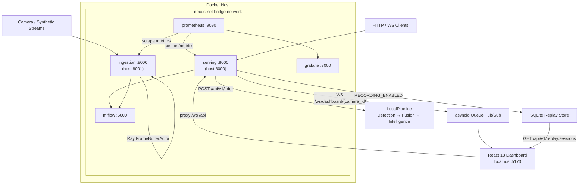
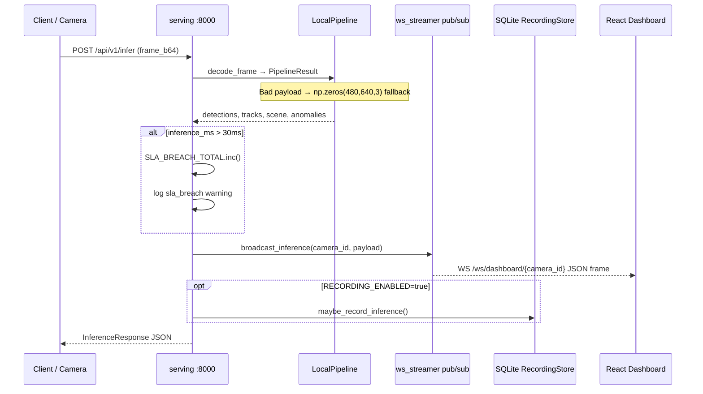
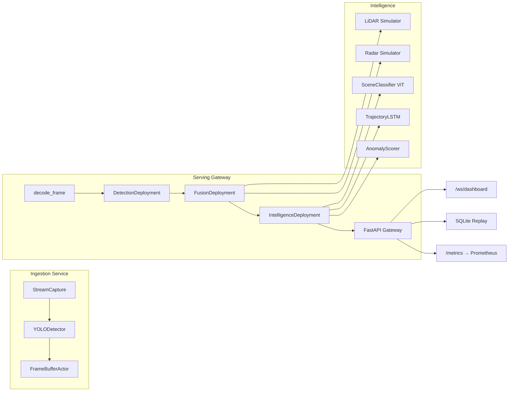

# NEXUS-CV


Production-grade real-time multi-modal computer vision intelligence platform with live observability, MLOps lifecycle, and cloud-native deployment.

[INSERT GIF: live dashboard demo]

---

## Features

| Capability | Description |
|------------|-------------|
| **Multi-camera ingestion** | Ray actors, YOLO11 detection, schema validation, quarantine |
| **Multi-modal fusion** | Kalman tracking, LiDAR/radar simulators, temporal sensor alignment |
| **Stacked AI** | ViT scene classification, trajectory LSTM, anomaly scoring ensemble |
| **Production serving** | FastAPI gateway, WebSocket streaming, gRPC, circuit breaker |
| **Live React 18 Observability Dashboard** | Real-time track overlays, metrics sparklines, anomaly feed — zero external UI libraries |
| **SLA breach tracing** | 30 ms inference threshold; breaches increment `nexus_cv_sla_breach_total` and emit structured `sla_breach` logs to Prometheus/Grafana |
| **Time-travel session debugger** | SQLite-backed recording/replay (`RECORDING_ENABLED=true`) with frame scrubber, play/pause, and annotated inference playback |
| **Graceful degradation** | Corrupt base64 payloads decode to a 640×480×3 BGR black frame — gateway stays up, empty inference logged upstream |
| **MLOps** | MLflow tracking, Evidently drift reports, automated retraining, model registry, DVC |
| **Infrastructure** | Terraform (GCP Cloud Run + AWS ECS), Helm HPA, Prometheus + Grafana |
| **CI/CD** | Parallel lint / test / build / Trivy security pipeline, GCR deploy to Cloud Run |

Business value and ROI: [docs/business_case.md](docs/business_case.md)

---

## System Architecture

### Docker Compose Topology (`nexus-net`)

Both **ingestion** and **serving** run as independent FastAPI-backed services on the shared bridge network. Internal container ports are both `:8000`; host mappings differ to prevent local port conflicts.

| Service | Host Port | Container Port | Role |
|---------|-----------|----------------|------|
| **serving** | `8000` | `8000` | Unified edge inference gateway (REST, WebSocket, gRPC, dashboard) |
| **ingestion** | `8001` | `8000` | Dual-pipeline Ray ingestion + Prometheus metrics |
| **mlflow** | `5001` | `5000` | Experiment tracking and model registry |
| **prometheus** | `9090` | `9090` | Telemetry scrape and storage |
| **grafana** | `3000` | `3000` | Dashboards and SLA visualization |



### Inference & Dashboard Sequence



### Pipeline Data Flow



See [docs/architecture.md](docs/architecture.md), [ARCHITECTURE.md](ARCHITECTURE.md), and [ADR.md](ADR.md) for full design decisions.

---

## Quick Start

```bash
git clone https://github.com/your-org/nexus-cv.git && cd nexus-cv
cp .env.example .env
docker compose up --build
```

| Endpoint | URL |
|----------|-----|
| Serving API | http://localhost:8000 |
| Ingestion metrics | http://localhost:8001/metrics |
| Grafana | http://localhost:3000 |
| MLflow | http://localhost:5001 |
| Prometheus | http://localhost:9090 |
| Dashboard UI | `cd dashboard/frontend && npm install && npm run dev` → http://localhost:5173 |

Full guide: [docs/quickstart.md](docs/quickstart.md)

---

## Project Structure

```
nexus-cv/
├── ingestion/          # Stream capture, YOLO, frame buffer, metrics API (:8000 internal)
├── fusion/             # Kalman tracking, sensor fusion
├── intelligence/       # Scene, trajectory LSTM, anomaly ensemble
├── serving/            # FastAPI gateway, Ray Serve, gRPC, SLA metrics
├── mlops/              # Drift, retraining, registry, MLflow retry utils
├── dashboard/          # WebSocket streamer, replay API, React 18 UI
├── infra/              # Terraform, Helm, Prometheus, Grafana, Loki
├── docs/               # Architecture, business case, deployment, API reference
└── tests/              # 83 automated unit/integration tests
```

---

## Performance

| Profile | p50 | p95 | Notes |
|---------|-----|-----|-------|
| Serving (M2 MPS, 1 cam) | 16 ms | 28 ms | GPU-accelerated pipeline |
| Serving (M2 MPS, 4 cam) | 32 ms | 49 ms | Multi-camera load |
| Ingestion YOLO only (Docker CPU) | ~105 ms | ~112 ms | Unaccelerated; exceeds 30 ms SLA |

SLA target: **30 ms** end-to-end inference. See [BENCHMARKS.md](BENCHMARKS.md) for methodology and breach surfacing.

---

## Configuration

| Variable | Default | Description |
|----------|---------|-------------|
| `NUM_CAMERAS` | 4 | Camera streams in ingestion pipeline |
| `YOLO_MODEL_PATH` | yolo11n.pt | Detection weights |
| `RECORDING_ENABLED` | false | Enable SQLite session replay debugger |
| `RECORDING_DB_PATH` | ./data/recordings/nexus_cv.db | Replay database location |
| `MLOPS_RETRAINING_ENABLED` | false | Drift-based retraining |
| `MLFLOW_TRACKING_URI` | http://localhost:5001 | Experiment tracking |

Full list: [.env.example](.env.example)

---

## Development

```bash
python -m venv .venv && source .venv/bin/activate
pip install -r requirements-dev.txt
pytest tests/ -v          # 83 tests
ruff check config ingestion fusion intelligence serving mlops dashboard tests
```

Optional dependency groups: `[gpu]`, `[dev]`, `[docs]` in `pyproject.toml`.

---

## Phase Completion

| Phase | Description | Status |
|-------|-------------|--------|
| **1** | Ingestion: stream capture, YOLO, frame buffer | ✅ Complete |
| **2** | Fusion: Kalman tracking, sensor alignment, FusionActor | ✅ Complete |
| **3** | Intelligence: scene, trajectory LSTM, anomaly ensemble | ✅ Complete |
| **4** | Serving: FastAPI gateway, Ray Serve, metrics, gRPC | ✅ Complete |
| **5** | MLOps: drift, retraining, registry, DVC | ✅ Complete |
| **6** | Dashboard, infra, CI/CD, observability, docs | ✅ **100% Complete** |

Engineering log: [PHASE_REPORT.md](PHASE_REPORT.md)

---

## Deployment

| Target | Command / Path |
|--------|----------------|
| Docker Compose | `docker compose up --build` |
| Kubernetes | `helm install nexus-cv ./infra/helm/nexus-cv` |
| GCP Cloud Run | `infra/terraform/gcp/` |
| AWS ECS Fargate | `infra/terraform/aws/` |

Guide: [docs/deployment.md](docs/deployment.md)

---

## License

MIT
