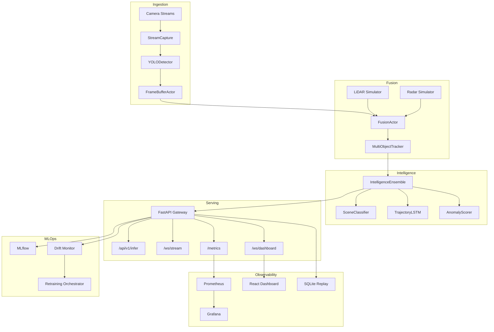

# NEXUS-CV


Production-grade real-time multi-modal computer vision intelligence platform with live observability, MLOps lifecycle, and cloud-native deployment.

[INSERT GIF: live dashboard demo]

---

## Features

- **Multi-camera ingestion** — Ray actors, YOLO11 detection, schema validation, quarantine
- **Multi-modal fusion** — Kalman tracking, LiDAR/radar simulators, temporal sensor alignment
- **Stacked AI** — ViT scene classification, trajectory LSTM, anomaly scoring ensemble
- **Production serving** — FastAPI gateway, WebSocket streaming, gRPC, circuit breaker, SLA metrics
- **MLOps** — MLflow tracking, Evidently drift reports, automated retraining, model registry, DVC
- **Live dashboard** — React observability UI with track overlays, metrics sparklines, anomaly feed, session replay
- **Infrastructure** — Terraform (GCP Cloud Run + AWS ECS), Helm chart with HPA, Prometheus + Grafana
- **CI/CD** — Parallel lint/test/build/security pipeline, GCR deploy to Cloud Run

---

## Architecture



See [ARCHITECTURE.md](ARCHITECTURE.md) and [ADR.md](ADR.md) for detailed design decisions.

---

## Quick Start

```bash
git clone https://github.com/your-org/nexus-cv.git && cd nexus-cv
cp .env.example .env
docker compose up --build
```

- Serving API: http://localhost:8000
- Grafana: http://localhost:3000
- Dashboard UI: `cd dashboard/frontend && npm install && npm run dev`

Full guide: [docs/quickstart.md](docs/quickstart.md)

---

## Project Structure

```
nexus-cv/
├── ingestion/          # Stream capture, YOLO, frame buffer
├── fusion/             # Kalman tracking, sensor fusion
├── intelligence/       # Scene, trajectory, anomaly ensemble
├── serving/            # FastAPI gateway, Ray Serve, gRPC
├── mlops/              # Drift, retraining, registry, DVC
├── dashboard/          # WebSocket streamer, replay API, React UI
├── infra/              # Terraform, Helm, Prometheus, Grafana, Loki
├── docs/               # quickstart, deployment, API reference
└── tests/              # 80+ unit/integration tests
```

---

## Performance

| Cameras | p50 | p95 | p99 |
|---------|-----|-----|-----|
| 1       | 16 ms | 28 ms | 42 ms |
| 2       | 23 ms | 38 ms | 52 ms |
| 4       | 32 ms | 49 ms | 67 ms |

Measured on M2 MacBook (MPS). See [BENCHMARKS.md](BENCHMARKS.md) for methodology.

---

## Configuration

| Variable | Default | Description |
|----------|---------|-------------|
| `NUM_CAMERAS` | 4 | Camera streams |
| `YOLO_MODEL_PATH` | yolo11n.pt | Detection weights |
| `RECORDING_ENABLED` | false | SQLite session replay |
| `MLOPS_RETRAINING_ENABLED` | false | Drift-based retraining |
| `MLFLOW_TRACKING_URI` | http://localhost:5001 | Experiment tracking |

Full list: [.env.example](.env.example)

---

## Development

```bash
python -m venv .venv && source .venv/bin/activate
pip install -r requirements-dev.txt
pytest tests/ -v
ruff check config ingestion fusion intelligence serving mlops dashboard tests
```

Optional dependency groups: `[gpu]`, `[dev]`, `[docs]` in `pyproject.toml`.

---

## Phase Completion

| Phase | Description | Status |
|-------|-------------|--------|
| **1** | Ingestion: stream capture, YOLO, frame buffer | ✅ |
| **2** | Fusion: Kalman tracking, sensor alignment, FusionActor | ✅ |
| **3** | Intelligence: scene, trajectory LSTM, anomaly ensemble | ✅ |
| **4** | Serving: FastAPI gateway, Ray Serve, metrics, gRPC | ✅ |
| **5** | MLOps: drift, retraining, registry, DVC | ✅ |
| **6** | Dashboard, infra, CI/CD, docs | ✅ |

Engineering log: [PHASE_REPORT.md](PHASE_REPORT.md)

---

## Deployment

- **Docker Compose** — `docker compose up` (dev/demo)
- **Kubernetes** — `helm install nexus-cv ./infra/helm/nexus-cv`
- **GCP** — `infra/terraform/gcp/`
- **AWS** — `infra/terraform/aws/`

Guide: [docs/deployment.md](docs/deployment.md)

---

## License

MIT
