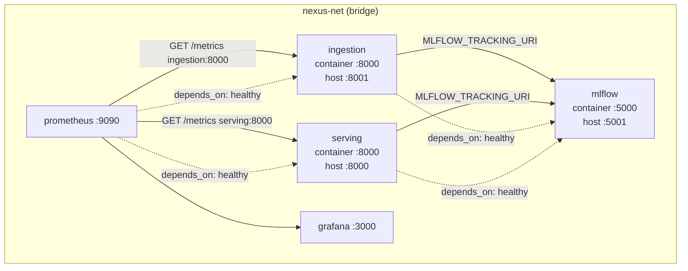
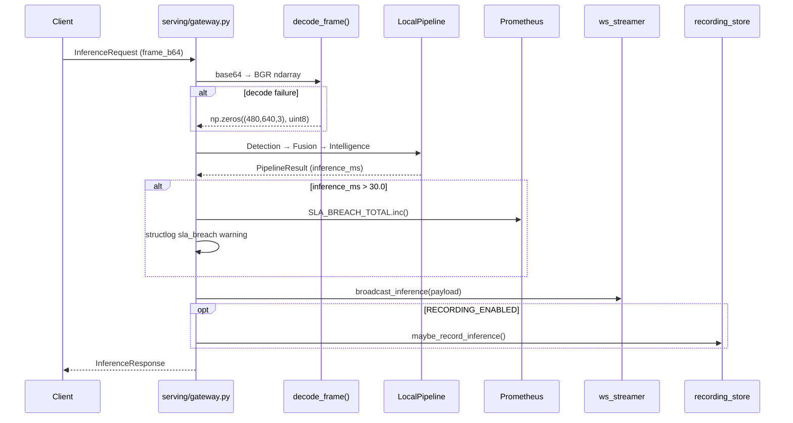

# NEXUS-CV System Architecture

Internal engineering reference for the NEXUS-CV real-time multi-modal computer vision intelligence platform — **Phase 6 complete**.

---

## 1. Executive Summary

NEXUS-CV is a dual-pipeline edge perception platform:

1. **Ingestion service** — continuously captures multi-camera streams, runs YOLO11 detection, validates schema contracts, and buffers annotated frames in Ray actors.
2. **Serving gateway** — exposes a unified inference API that fuses camera detections with simulated LiDAR/radar readings, runs stacked AI (scene classification, trajectory prediction, anomaly scoring), and streams enriched frames to a live React 18 dashboard.

Both services communicate over the Docker Compose **`nexus-net`** bridge network, export Prometheus metrics on internal port **8000**, and register startup telemetry with MLflow after a health-gated boot sequence.

---

## 2. Technology Stack

| Layer | Technology | Role |
|-------|-----------|------|
| Language | Python 3.12 | Core runtime |
| Stream I/O | OpenCV + asyncio | Non-blocking RTSP / synthetic capture |
| Inference | Ultralytics YOLO11 | Object detection (PyTorch / TensorRT) |
| Distributed runtime | Ray 2.40 | Actor-based frame buffering |
| Fusion | Kalman + Hungarian MOT | Multi-object tracking |
| Intelligence | ViT, LSTM, heuristics | Scene, trajectory, anomaly |
| API gateway | FastAPI + uvicorn | REST, WebSocket, metrics |
| Frontend | React 18 + Vite + Tailwind | Live observability dashboard |
| Schema validation | Pandera 0.21 | Detection contract enforcement |
| Configuration | pydantic-settings | Typed env-based config |
| Logging | structlog | Structured JSON logs |
| Experiment tracking | MLflow 2.18 | Model registry and startup runs |
| Metrics | Prometheus + Grafana | Dual-service telemetry |
| Recording | SQLite | Session replay debugger |
| Containerization | Docker Compose | Local, CI, and demo deployment |
| Orchestration | Helm + Terraform | K8s HPA, GCP Cloud Run, AWS ECS |

---

## 3. Docker Compose Deployment Topology



### Service Responsibilities

| Service | Image | Internal Bind | Host Mapping | Health Probe |
|---------|-------|---------------|--------------|--------------|
| `ingestion` | `Dockerfile.ingestion` | `0.0.0.0:8000` | `8001:8000` | `GET /health` |
| `serving` | `Dockerfile.serving` (production target) | `0.0.0.0:8000` | `8000:8000` | `GET /health` |
| `mlflow` | `ghcr.io/mlflow/mlflow:v2.18.0` | `0.0.0.0:5000` | `5001:5000` | `GET /health` |
| `prometheus` | `prom/prometheus:v3.0.1` | `:9090` | `9090:9090` | — |
| `grafana` | `grafana/grafana:11.4.0` | `:3000` | `3000:3000` | — |

**Port separation rationale:** Both services bind `:8000` inside the network namespace (Prometheus scrapes `ingestion:8000` and `serving:8000` by DNS name). Host mappings differ (`8001` vs `8000`) to avoid local port allocation conflicts. See [ADR-004](../ADR.md#adr-004-multi-service-port-separation).

---

## 4. Ingestion Pipeline

### Data Flow

```
RTSP / synthetic:// → StreamCapture → YOLODetector.detect_batch()
    → validate_detections() → FrameBufferActor.push()
    → Prometheus counters (frames, detections, yolo latency)
```

### Key Components

| Module | Responsibility |
|--------|----------------|
| `StreamCapture` | Async frame generator with RTSP reconnect backoff |
| `YOLODetector` | Lazy YOLO11 load; batch inference with confidence/IoU thresholds |
| `FrameBufferActor` | Ray actor with bounded `deque` per camera |
| `validate_detections()` | Pandera schema enforcement; quarantine to Parquet |
| `ingestion/app.py` | FastAPI `/health` + `/metrics` on `0.0.0.0:8000` |
| `scripts/run_ingestion.py` | Starts metrics API thread, waits for MLflow, runs camera pipelines |

### Ingestion Metrics (Prometheus)

| Metric | Type | Labels |
|--------|------|--------|
| `nexus_cv_frames_processed_total` | Counter | `camera_id` |
| `nexus_cv_detections_total` | Counter | `camera_id`, `class_name` |
| `nexus_cv_yolo_inference_duration_ms` | Histogram | `camera_id` |
| `nexus_cv_quarantine_total` | Counter | `camera_id` |
| `nexus_cv_active_cameras` | Gauge | — |

---

## 5. Serving Gateway

### Request Lifecycle



### Pipeline Stages (`serving/deployments.py`)

| Stage | Class | Output |
|-------|-------|--------|
| Detection | `DetectionDeployment` | Bounding boxes via YOLO11 |
| Fusion | `FusionDeployment` | Kalman tracks + LiDAR/radar modalities |
| Intelligence | `IntelligenceDeployment` | Scene, trajectories, anomaly scores |

### Gateway Endpoints

| Method | Path | Purpose |
|--------|------|---------|
| `GET` | `/health` | Aggregate component health |
| `GET` | `/metrics` | Prometheus exposition |
| `POST` | `/api/v1/infer` | Single-frame full pipeline inference |
| `WS` | `/ws/stream/{camera_id}` | Bidirectional JPEG → JSON stream |
| `WS` | `/ws/dashboard/{camera_id}` | Server-push dashboard JSON |
| `GET` | `/api/v1/replay/sessions` | List recorded sessions |
| `GET` | `/api/v1/replay/sessions/{id}/frames` | Paginated frame metadata |
| `GET` | `/api/v1/replay/sessions/{id}/frames/{fid}` | Full inference payload |

### Serving Metrics (Prometheus)

| Metric | Type | Purpose |
|--------|------|---------|
| `nexus_cv_inference_duration_ms` | Histogram | End-to-end pipeline latency |
| `nexus_cv_sla_breach_total` | Counter | Requests exceeding 30 ms SLA |
| `nexus_cv_serving_duration_ms` | Histogram | Wall-clock gateway latency by endpoint |
| `nexus_cv_active_tracks` | Gauge | Live fused track count |
| `nexus_cv_anomaly_detections_total` | Counter | Anomaly events by camera/factor |
| `nexus_cv_circuit_breaker_state` | Gauge | 0=closed, 1=open |

---

## 6. Live Dashboard & Session Replay

### WebSocket Pub/Sub (`dashboard/backend/ws_streamer.py`)

After each inference, `_publish_dashboard_update()` in `serving/gateway.py` builds a JSON payload and calls `broadcast_inference()`. Subscribers connect via `WS /ws/dashboard/{camera_id}` and receive:

```json
{
  "frame_b64": "...",
  "detections": [], "tracks": [], "trajectories": [], "anomalies": [],
  "scene": {}, "metrics": { "inference_ms": 18.4, "active_tracks": 5 },
  "request_id": "uuid", "camera_id": "cam_00", "inference_ms": 18.4
}
```

The React 18 frontend (`dashboard/frontend/`) renders:
- **VideoCanvas** — JPEG frames at ~30 fps via `requestAnimationFrame`
- **TrackOverlay** — SVG bboxes, velocity arrows, trajectory polylines, anomaly badges
- **MetricsPanel** — sparklines for inference_ms, active tracks, SLA breach rate
- **AnomalyFeed** — scrolling anomaly events
- **ReplayControls** — session selector, scrubber, play/pause/step

### SQLite Recording Engine (`dashboard/backend/recording_store.py`)

When `RECORDING_ENABLED=true`, `maybe_record_inference()` persists each dashboard payload to SQLite. The replay REST API enables the **time-travel session debugger** — operators can scrub to exact frames where SLA breaches or false positives occurred.

---

## 7. Graceful Degradation

### Fallback Frames (ADR-005)

`serving/deployments.py` → `decode_frame()`:

```python
fallback = np.zeros((480, 640, 3), dtype=np.uint8)
# On base64 decode failure or cv2.imdecode returning None:
logger.warning("frame_decode_failed", ...)
return fallback
```

The pipeline continues with an empty black frame rather than raising HTTP 500. Detections will be empty; the gateway, WebSocket subscribers, and Prometheus counters remain operational.

### Optional Dependency Resilience

Ray actors, ultralytics, and torch use lazy imports with no-op decorators or clear `ImportError` messages when absent — modules import cleanly in CI without GPU dependencies.

### MLflow Startup Retry (`mlops/mlflow_utils.py`)

Both services call `wait_for_mlflow()` before initializing `MlflowClient`, polling `/health` with exponential backoff (up to 30 attempts). Docker Compose `depends_on: condition: service_healthy` provides an additional boot-order guarantee.

---

## 8. SLA Monitoring

| Constant | Value | Location |
|----------|-------|----------|
| `SLA_THRESHOLD_MS` | `30.0` | `serving/gateway.py` |

When `result.inference_ms > SLA_THRESHOLD_MS`:

1. `SLA_BREACH_TOTAL.inc()` — Prometheus counter
2. `logger.warning("sla_breach", request_id=..., inference_ms=..., threshold_ms=30.0)` — structured log
3. Dashboard payload includes `inference_ms` for live sparkline breach visualization
4. Grafana panel `SLA Breach Rate` turns red when rate exceeds 1%

---

## 9. MLOps Integration

| Component | Trigger | Output |
|-----------|---------|--------|
| `NexusExperimentTracker` | Retraining, benchmarks | MLflow runs, artifacts |
| `DriftMonitor` | 100k frames or 1 hour | Evidently HTML report |
| `RetrainingOrchestrator` | Drift threshold exceeded | Model promotion workflow |
| `log_service_startup()` | Container boot | `ingestion-startup` / `serving-startup` MLflow runs |

---

## 10. CI/CD & Quality Gates

| Job | Tooling | Gate |
|-----|---------|------|
| `lint` | ruff, black, mypy `--strict` | Must pass |
| `test` | pytest (83 tests), coverage XML → Codecov | Must pass |
| `build` | `docker build --target production` | Must pass |
| `security` | Trivy CRITICAL CVE scan | Fail on CRITICAL |

All jobs run in parallel where dependencies allow (`.github/workflows/ci.yml`).

---

## 11. Phase Roadmap

| Phase | Scope | Status |
|-------|-------|--------|
| 1 | Ingestion, detection, buffering, validation | ✅ Complete |
| 2 | Multi-modal fusion, Kalman tracking | ✅ Complete |
| 3 | Stacked AI intelligence ensemble | ✅ Complete |
| 4 | Serving gateway, Ray Serve, SLA metrics | ✅ Complete |
| 5 | MLOps lifecycle, drift, retraining | ✅ Complete |
| 6 | Dashboard, infra, CI/CD, observability | ✅ **100% Complete** |

---

## 12. Related Documents

| Document | Purpose |
|----------|---------|
| [ADR.md](../ADR.md) | Architecture Decision Records |
| [BENCHMARKS.md](../BENCHMARKS.md) | Performance profiles and SLA analysis |
| [PHASE_REPORT.md](../PHASE_REPORT.md) | Phase-by-phase engineering log |
| [business_case.md](business_case.md) | Business value and ROI |
| [deployment.md](deployment.md) | Production deployment guide |
| [api_reference.md](api_reference.md) | REST / WebSocket API spec |
